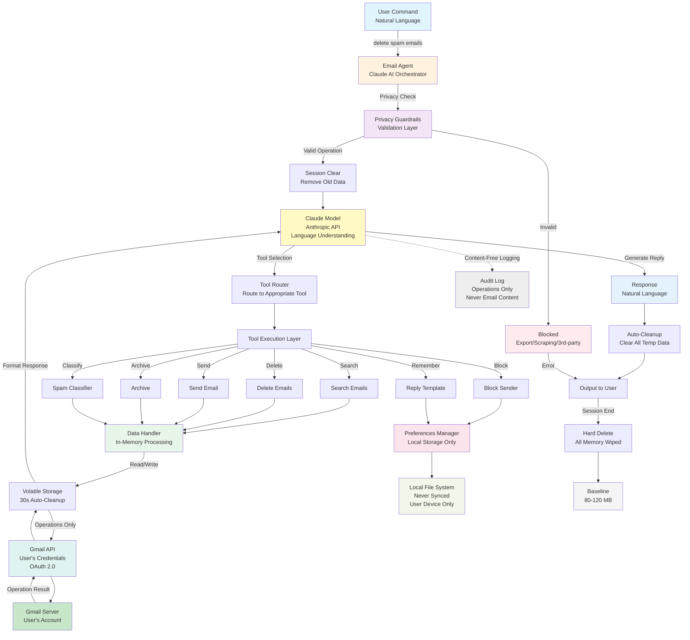
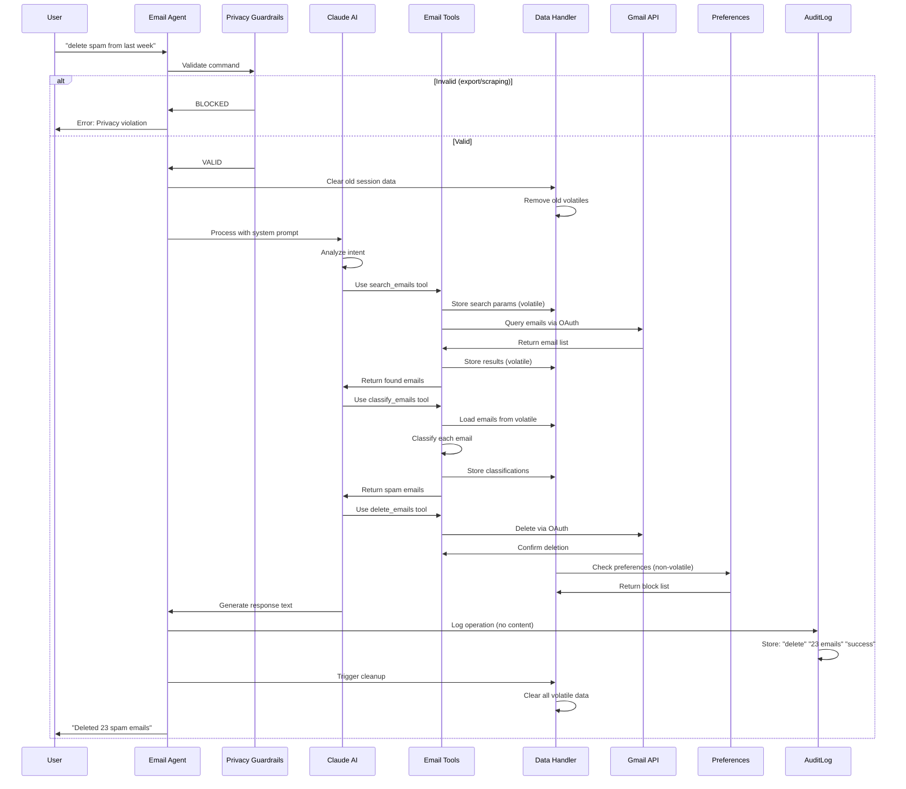
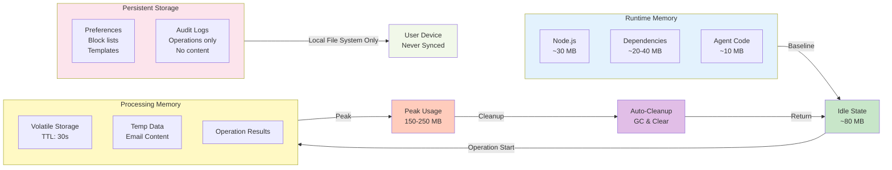
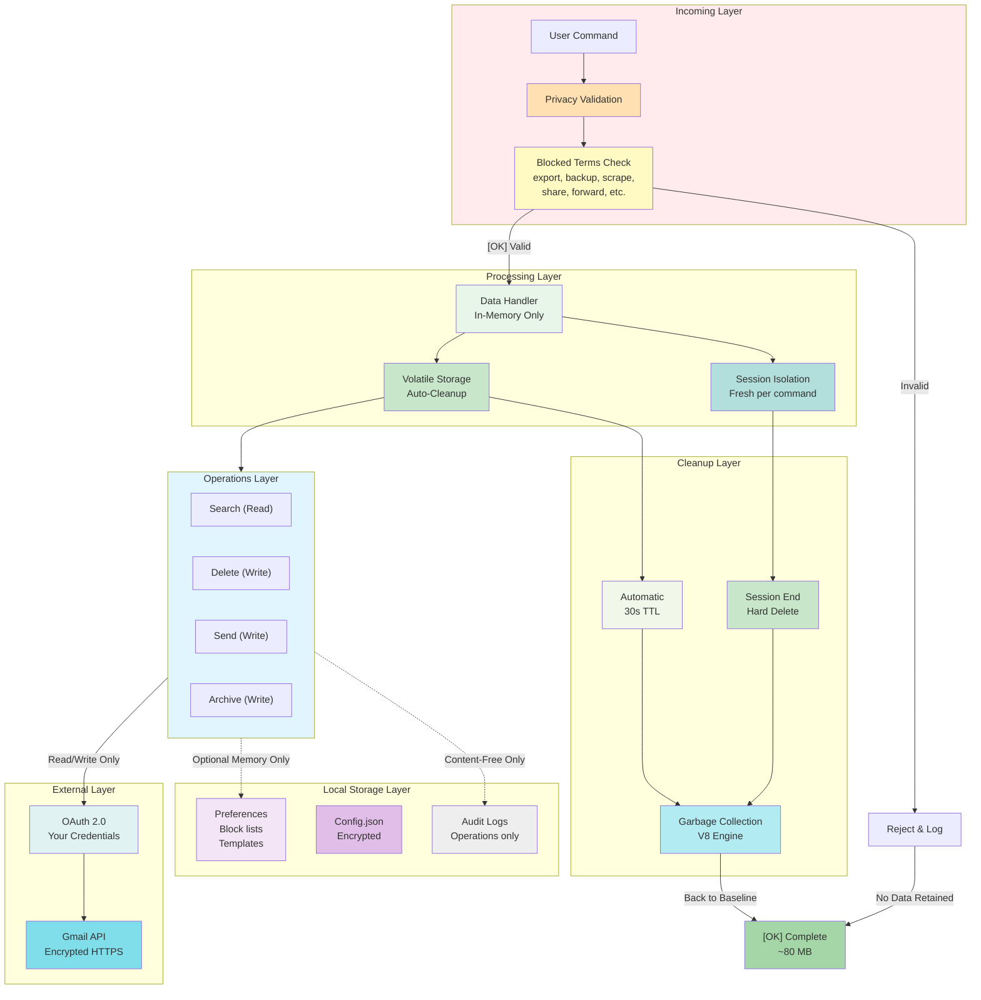
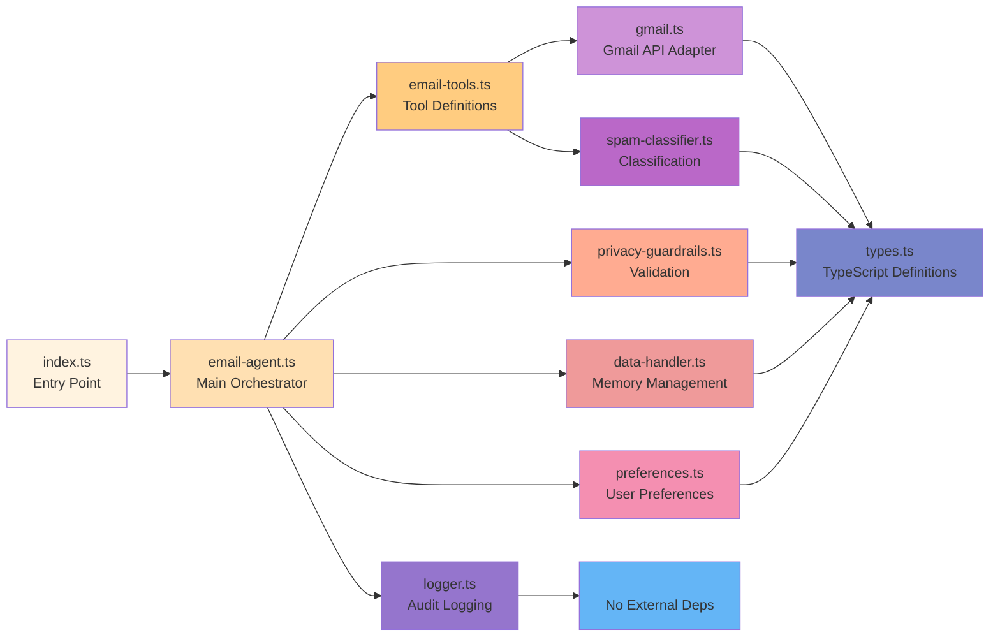
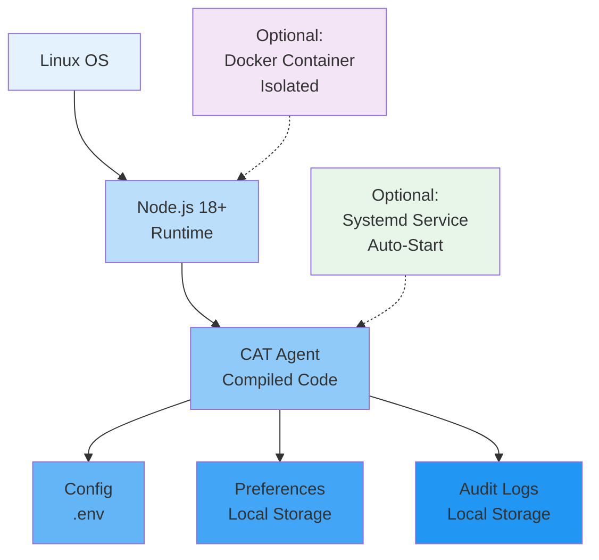
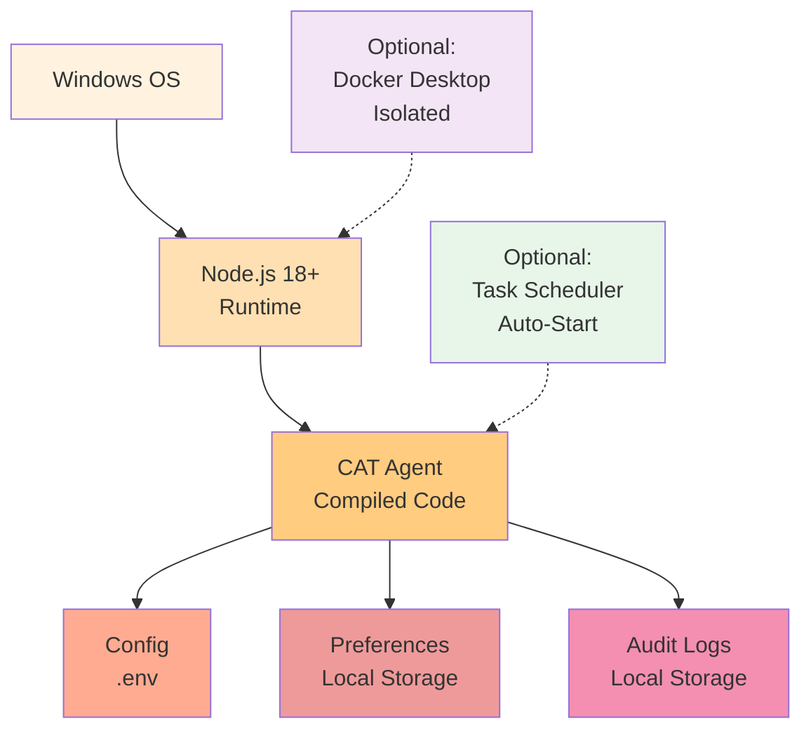
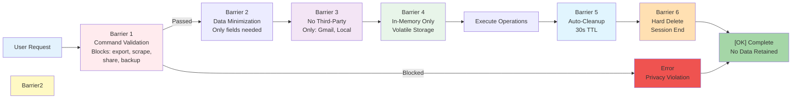
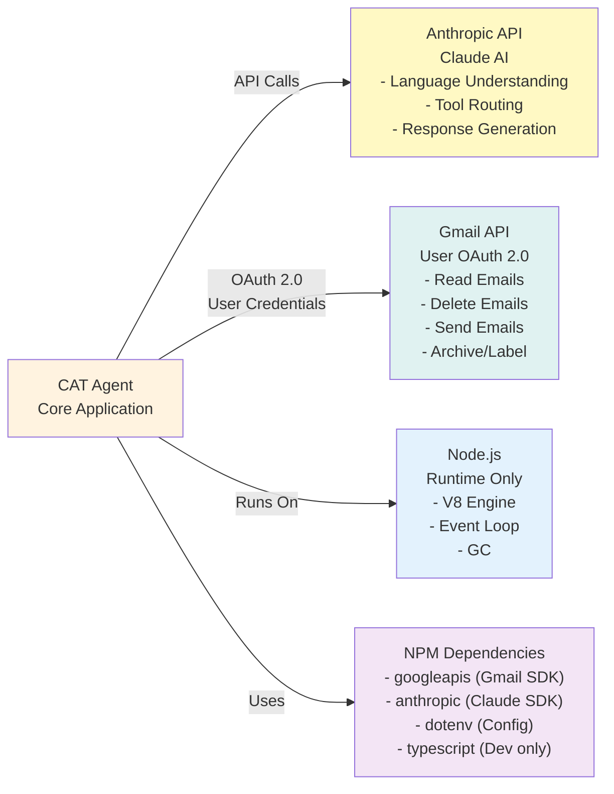
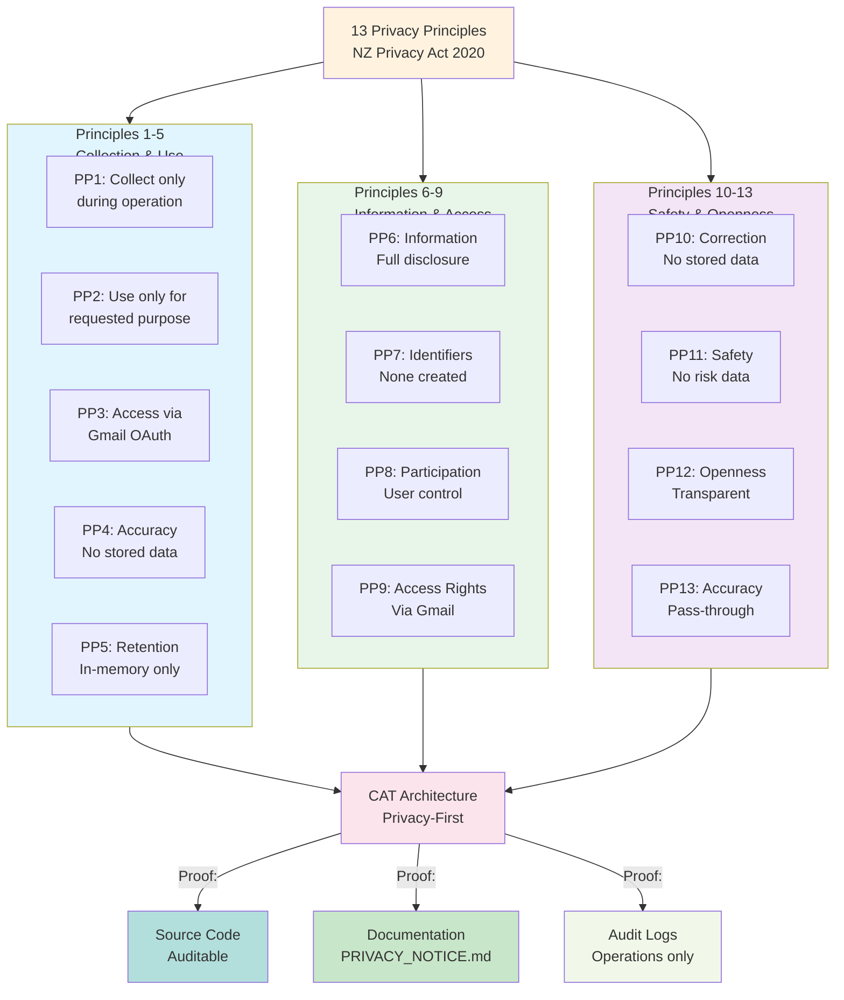

# CAT Email Agent - Architecture Diagram

## System Architecture

---

## Data Flow Sequence

---

## Memory Architecture

---

## Privacy & Security Layers

---

## Module Dependencies

---

## Deployment Architecture

### Linux Deployment

### Windows Deployment

---

## Security & Privacy Flow

---

## External Dependencies

---

## NZ Privacy Act Alignment

---

**Last Updated**: July 14, 2026 
**Format**: Mermaid Diagrams 
**Status**: [OK] Complete Architecture Documentation
